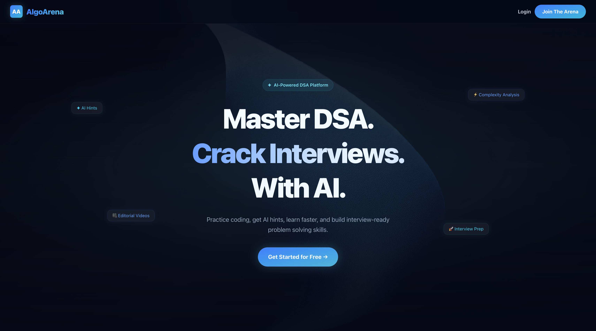
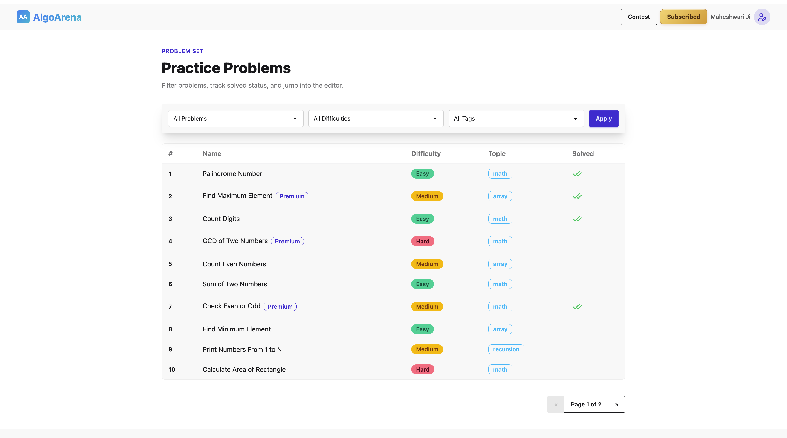
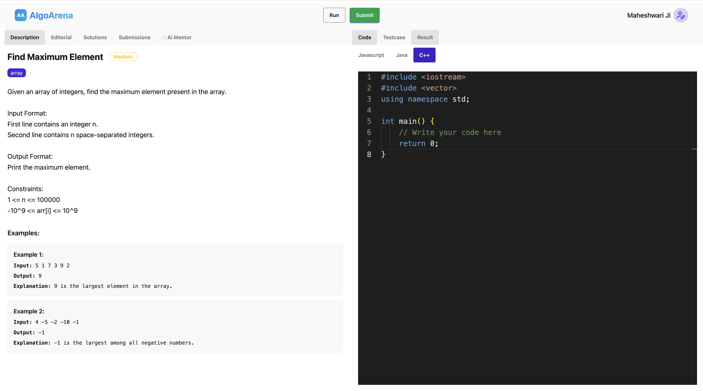
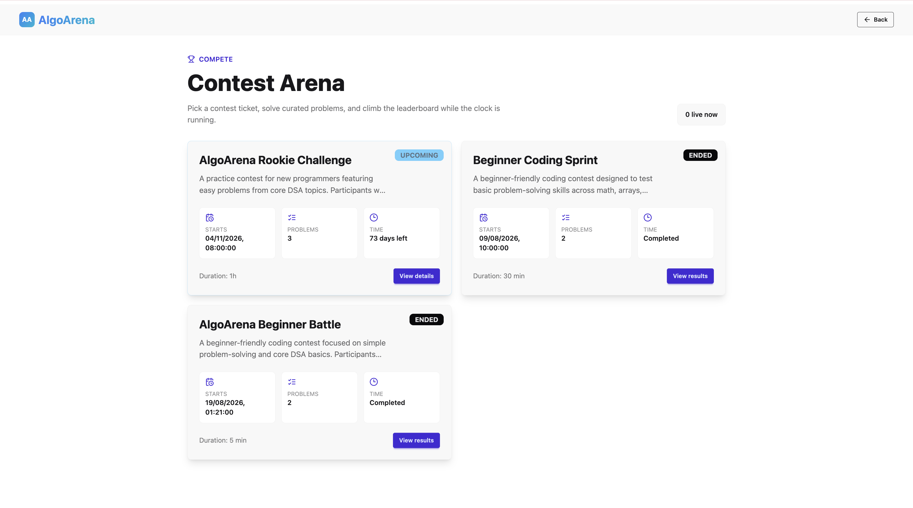
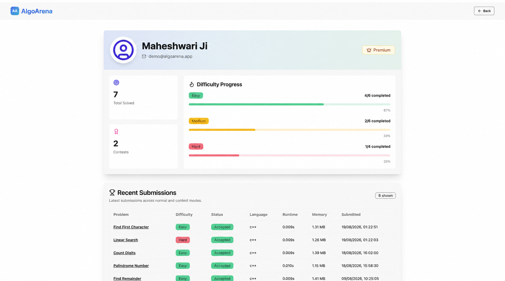
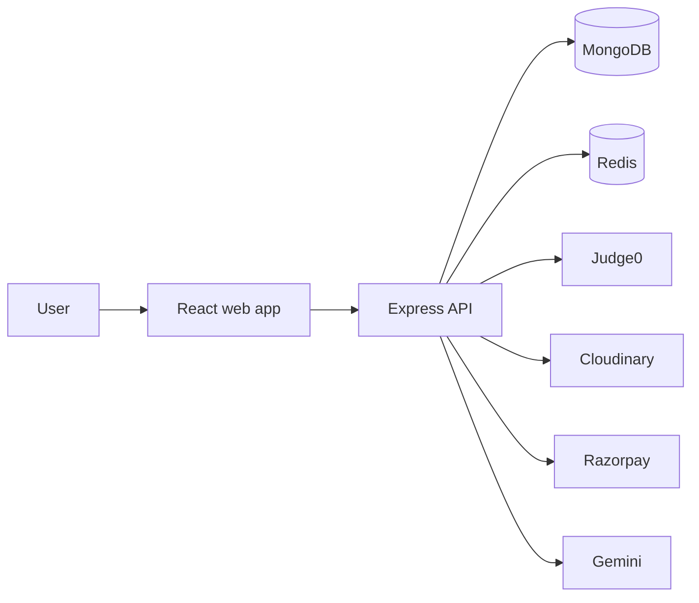

# AlgoArena

AlgoArena is a full-stack coding practice platform for solving programming problems, participating in contests, reviewing submissions, and learning through editorials and AI-assisted doubt solving.

> **Showcase repository:** The production source code is intentionally kept private. This repository contains product documentation and a high-level architecture overview only.

## Preview

## Highlights

- Problem solving with run and submit flows powered by Judge0
- Visible and hidden test cases with submission history
- Live, upcoming, and completed coding contests
- Score-based leaderboards with tie-time ranking
- Email/password and Google authentication
- Role-based admin tools for problems, contests, and video editorials
- Premium membership flow with verified Razorpay payments
- Cloudinary-hosted video editorials
- AI-assisted doubt solving with Gemini
- Personal dashboard with progress and activity insights

## Product Tour

<table>
  <tr>
    <td width="50%">
      
      
<strong>Practice problem library</strong>

    </td>
    <td width="50%">
      
      
<strong>Problem workspace and code editor</strong>

    </td>
  </tr>
  <tr>
    <td width="50%">
      
      
<strong>Coding contest arena</strong>

    </td>
    <td width="50%">
      
      
<strong>Progress dashboard</strong>

    </td>
  </tr>
</table>

## Technology

| Area | Technologies |
| --- | --- |
| Frontend | React, Vite, Redux Toolkit, Tailwind CSS, DaisyUI, Monaco Editor |
| Backend | Node.js, Express, MongoDB, Mongoose |
| Authentication | JWT, bcrypt, Google OAuth |
| Execution | Judge0 via RapidAPI |
| Infrastructure | Redis, Cloudinary |
| Integrations | Razorpay, Gemini |

## How the platform works

More detail is available in [Architecture](docs/ARCHITECTURE.md) and [Product Features](docs/FEATURES.md).

## Repository policy

This public repository is intended for portfolio and product demonstration purposes. It does **not** contain:

- frontend or backend source code
- environment variables, credentials, or deployment configuration
- GitHub Actions workflows
- database schemas or production infrastructure details

The application source and deployment pipeline are maintained in a separate private repository.

## Ownership

Copyright © 2026 Raghav Maheshwari. All rights reserved.

No license is granted to copy, modify, redistribute, sublicense, or use the private AlgoArena implementation. See [COPYRIGHT.md](COPYRIGHT.md).
