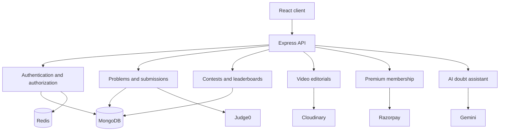

# Architecture Overview

AlgoArena uses a React single-page application backed by a Node.js and Express API. Persistent application data is stored in MongoDB, while Redis supports short-lived authentication and session-related state.

## Main components

## Design notes

- Authentication supports standard credentials and Google OAuth.
- User and administrator permissions are enforced at the API boundary.
- Code execution is delegated to Judge0; application services manage validation and result persistence.
- Contest submissions are separated from normal practice activity for scoring and history.
- Payment verification happens server-side before premium access is granted.
- Video assets are stored outside the application server and linked to problem metadata.

This document intentionally describes the system at a high level and excludes implementation details, private endpoints, credentials, and deployment configuration.

